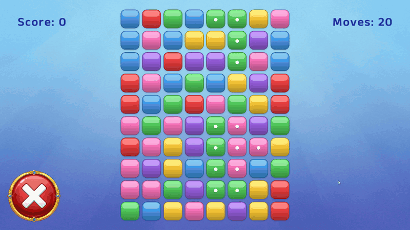
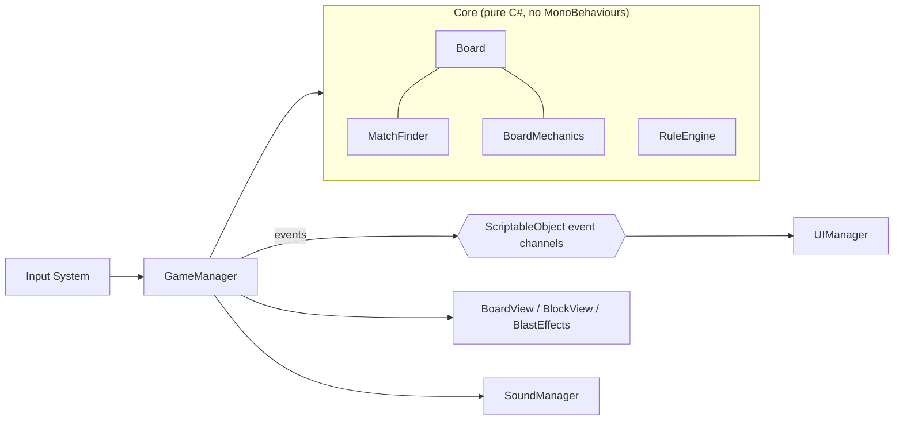

# GemBlast


A tile-blast puzzle game built with Unity 6. Tap a group of two or more connected same-colored gems to blast it. Gems above fall to fill the gap, new ones drop in from the top, and each gem's icon upgrades with the size of the group it belongs to. You have a fixed number of moves to reach the highest score you can.

[](https://muratfatihdemirel.me/media/gemblast.mp4)

## Features

**Core gameplay**
- **Blast:** BFS finds the connected same-color group under the tap.
- **Gravity and refill:** columns compact downward, then empty cells are filled with random gems.
- **Dynamic icons:** every gem shows an icon tier (Default / A / B / C) based on its group size, so you can read the board at a glance.
- **Deadlock handling:** the game detects when no valid move is left and reshuffles the board so that at least one group is guaranteed to exist.
- **Scoring:** points grow with the square of the group size. The best score is saved between sessions.

**Game feel**
- Gems burst into shards on every blast, with a floating score popup (gold for big blasts)
- Blast, drop, punch and scale animations with [PrimeTween](https://github.com/KyryloKuzyk/PrimeTween)
- Camera shake that scales with blast size
- Separate sound effects for small blasts, big blasts and drops

**Performance**
- Union-Find computes all group sizes in a single near-linear pass for icon updates and deadlock detection.
- Match search, gravity and shuffle reuse preallocated buffers, so the game loop does not allocate per move.
- Object pooling for block views, shards and score popups
- A sprite atlas batches all gem sprites.

## Architecture



```
Assets/_Project/Scripts
├── Core/          Pure C# game logic (GemBlast.Core assembly)
│   ├── Board, BlockData        Grid state; BlockData is an immutable struct
│   ├── MatchFinder             BFS group search + Union-Find group sizes
│   ├── BoardMechanics          Blast, gravity, refill, deadlock detection, seedable shuffle
│   ├── RuleEngine              Group size to icon tier mapping
│   └── GameConfig              ScriptableObject: board, colors, thresholds, scoring, timings
├── Controllers/   GameManager: input, turn flow, score and moves
├── View/          BoardView / BlockView / BlastEffects: rendering, pooling, animation
├── UI/            UIManager: HUD, game-over screen, high score
├── Audio/         SoundManager
└── Architecture/  ScriptableObject event channels (GameEvent, IntGameEvent + listeners)
```

- **Logic and presentation are separated.** The `Core` assembly has no dependency on the view layer, so it is unit tested in EditMode without a scene.
- **Event-driven UI:** score, moves and game-over are broadcast through ScriptableObject event channels. The UI subscribes to those channels and does not reference `GameManager` directly.
- **Data-driven configuration:** board size, color count, match size, icon thresholds, scoring and timings all live in a `GameConfig` asset.

## Tests

39 EditMode tests cover `MatchFinder`, `BoardMechanics` and `RuleEngine`.

Run them locally from **Window > General > Test Runner > EditMode > Run All**.

## Getting started

1. Install **Unity 6000.2.9f1** or a compatible Unity 6 version.
2. Clone the repository and open the folder with Unity Hub. PrimeTween is restored from the npm registry automatically.
3. Open `Assets/_Project/Scenes/Gameplay.unity` and press Play.

Prebuilt Windows binaries are attached to each [release](https://github.com/s0shaw/unity-blast-game/releases).

## Tech

- Unity 6 (URP 2D)
- Input System
- TextMeshPro
- PrimeTween

## Credits

- Gem sprites: generated procedurally with a small Python/Pillow script
- Sound effects: generated with ElevenLabs and edited in Audacity
- Font: [Anek Malayalam](https://fonts.google.com/specimen/Anek+Malayalam), SIL Open Font License
- Tweening: [PrimeTween](https://github.com/KyryloKuzyk/PrimeTween) by Kyrylo Kuzyk

AI tools were used during development: an AI assistant for coding, AI image generation for UI art, and AI audio generation for sound effects.

## License

Code is released under the [MIT License](LICENSE).
